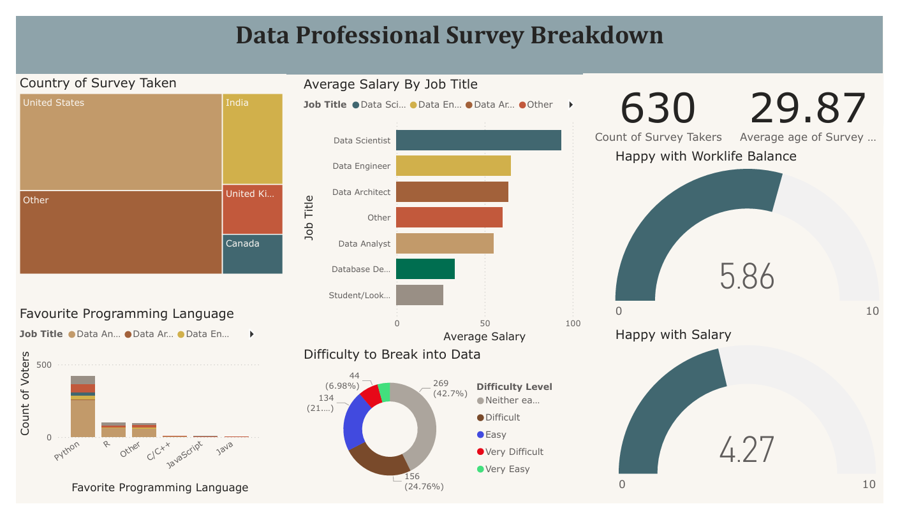

# 📊 Data Professional Survey Breakdown – Power BI Dashboard

This Power BI project analyzes survey data collected by a YouTuber from 630 data professionals around the world. The goal of the project is to gain insights into the demographics, preferences, job roles, and work satisfaction of people working in the data field.

## 🚀 Project Highlights

- **Data Source:** YouTuber-collected survey dataset
- **Tool Used:** Microsoft Power BI
- **Total Respondents:** 630
- **Average Age of Participants:** 29.87 years

## 📈 Key Visual Insights

- 🌍 **Country Distribution:** Breakdown of where the survey was taken (top countries include USA, India, UK, Canada)
- 💼 **Average Salary by Job Title:** Comparison across Data Scientist, Data Engineer, Data Analyst, etc.
- 🧠 **Difficulty of Entering Data Industry:** Majority rated it as “Neither Easy nor Difficult” or “Difficult”
- 🗣 **Favorite Programming Language:** Python leads significantly, followed by R and others
- ⚖ **Job Satisfaction Metrics:**
  - Average score for **Work-Life Balance:** 5.86/10
  - Average score for **Salary Satisfaction:** 4.27/10

## 📂 Files Included

- `Power BI - Final Project.xlsx` – Raw dataset used for analysis
- `Dashboard Screenshot.png` – Final dashboard visualization

## 🎯 Skills Demonstrated

- Data Cleaning and Transformation (Power Query)
- Data Modeling
- DAX Calculations
- Interactive Visual Design
- Insight Communication

## 💡 Insights & Reflections

This dashboard showcases how survey data can uncover meaningful trends in the data profession. It highlights areas where professionals are satisfied (work-life balance) and where improvements are needed (salary satisfaction). It also reveals job popularity, programming trends, and entry-level challenges in the field.

## 📬 Contact

Feel free to connect if you’d like to discuss the project or provide feedback!

---
